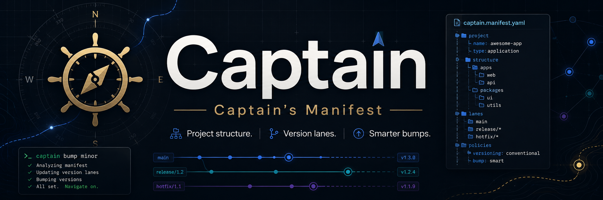

# Captain

<p align="center">
    
</p>

Captain is the orchestration engine for the **Captain ecosystem**. It coordinates project metadata, builds, packaging, environment preparation, local service lifecycle, ecosystem tooling, and publishing without allowing those domains to collapse into one tool. The user-facing `captain` executable is provided by the separate `captain-cli` package.

## One Captain-owned manifest

A Captain project has one source-of-truth manifest:

```text
project/
└── manifest.json
```

The document uses the shared `captain/manifest/v1` contract defined by Captain Core.

```json
{
  "schema": "captain/manifest/v1",
  "project": {
    "name": "vibrancy-nucleus",
    "type": "native",
    "version": "1.0.0"
  },
  "versionLanes": {},
  "components": [],
  "system": {},
  "build": {},
  "stager": {},
  "embark": {},
  "dockhand": {},
  "servicewright": {}
}
```

Captain Core owns project selection, Captain-owned manifest resolution, shared manifest loading/validation, common models/errors, and filesystem safety. Captain owns orchestration. Each ecosystem tool owns the semantics of its configuration.

Captain supports monolithic, split, and hybrid manifests. The root `manifest.json` is always authoritative; tool-specific files under `manifests/` are still Captain-owned and are resolved before being handed to their respective tools.

## Ecosystem boundaries

```text
Captain Core
├── project + manifest contracts
├── shared discovery
├── shared path safety
└── shared models/errors

Captain CLI
└── command parsing, terminal UX, project selection, exit behavior

Captain
└── orchestration engine and workflow APIs

Outfit
└── host/system capabilities

Stager
└── installation filesystem layout

Embark
└── native package generation

Dockhand
└── current-host environment preparation

ServiceWright
└── local service lifecycle

SchemaWright
└── database/schema lifecycle artifacts

Deploy tool (future)
└── remote server/fleet rollout
```

## Command vocabulary

`captain-cli` exposes the user-facing command vocabulary while delegating orchestration to Captain. The command names are intentionally reserved by responsibility:

```text
captain build       build the project
captain package     produce installable/native artifacts
captain provision   prepare the current host/application

captain start
captain status
captain restart
captain stop
captain remove      local application/service lifecycle

captain install     install Captain ecosystem tools
captain deploy      reserved for future remote server/fleet rollout
```

`deploy` must not be used for local service management. `install` must not be used for application deployment because it is reserved for installing Captain ecosystem tooling.

## Development

```bash
npm install
npm run build
npm test
```

Captain itself now builds as a library. For the executable, develop/install the sibling `captain-cli` package.

Captain CLI project commands operate on the selected project directory. Without `--project`, the CLI uses the current working directory and expects `manifest.json` there; it does not silently select a different project.

```bash
captain build
captain --project /srv/my-project build
```

## Initialize a project

```bash
captain init --name my-project --type monolith --version 1.0.0
```

Captain creates the canonical root manifest and generated release metadata:

```text
manifest.json

.captain/
└── generated/
    ├── master_manifest.json
    └── bump_rules.json
```

Generated files are derived data; the project-root `manifest.json` remains the source of truth.

Tool configuration can stay inline or be split into Captain-owned files:

```text
<project root>/
├── manifest.json
└── manifests/
    ├── build.json
    ├── stager.json
    ├── embark.json
    ├── dockhand.json
    ├── servicewright.json
    └── schemawright.json
```

A project may mix inline and referenced tool configuration. A tool cannot be configured both ways at the same time.

## Existing project/version features

The unified manifest still owns Captain's established project model:

- project metadata
- version lanes
- components
- generated master release metadata
- generated bump rules
- version bump analysis
- system capability declarations
- build configuration

A version lane is a named version track such as `configuration`, `database`, `apis`, `dashboard`, or `audioEngine`. Components assign project paths or logical subsystems to those lanes.

## Build and package flow

The intended local build/package sequence is:

```text
manifest.json
        ↓
Captain build
        ↓
Captain artifact
        ↓
Stager
        ↓
installation filesystem
        ↓
Embark
        ↓
native package
```

Environment preparation and service lifecycle remain separate responsibilities:

```text
native package / application
        ↓
Captain provision
        ↓
Dockhand environment preparation
        ↓
ServiceWright registration
        ↓
start / status / restart / stop / remove
```

Remote rollout is intentionally outside this workflow and reserved for the future `captain deploy` namespace.

### Named build targets

`captain/build/v0.2` projects can declare multiple named build targets while
`captain/build/v0.1` remains supported for single-build projects. A target owns its
build commands, expected outputs, and Captain artifact definition:

```bash
captain build targets
captain build plan --target web
captain build run --target web
captain build package --target web
```

A `defaultTarget` lets normal `captain build` behavior remain concise. Target names
are project-defined; Captain does not hard-code concepts such as web or Electron.

## Package publishing

Captain keeps package creation separate from network publishing. Finished native packages can be published after a successful local package build:

```bash
captain package publish --dry-run
captain package publish --destination github
captain package publish --destination github --format deb
```

Publish destinations are Captain-owned project configuration:

```json
{
  "publish": {
    "destinations": {
      "github": {
        "provider": "github-release",
        "repository": "owner/repository"
      }
    }
  }
}
```

The GitHub Release provider defaults to tag and release name `v<project.version>`. Optional `tag`, `releaseName`, `draft`, `prerelease`, and `generateReleaseNotes` fields can override release behavior. Authentication is read from `GH_TOKEN` or `GITHUB_TOKEN`; credentials do not belong in the manifest.

The destination map is intentionally provider-neutral so external mirrors such as S3-compatible storage can be added without coupling package builds to a specific release service.
